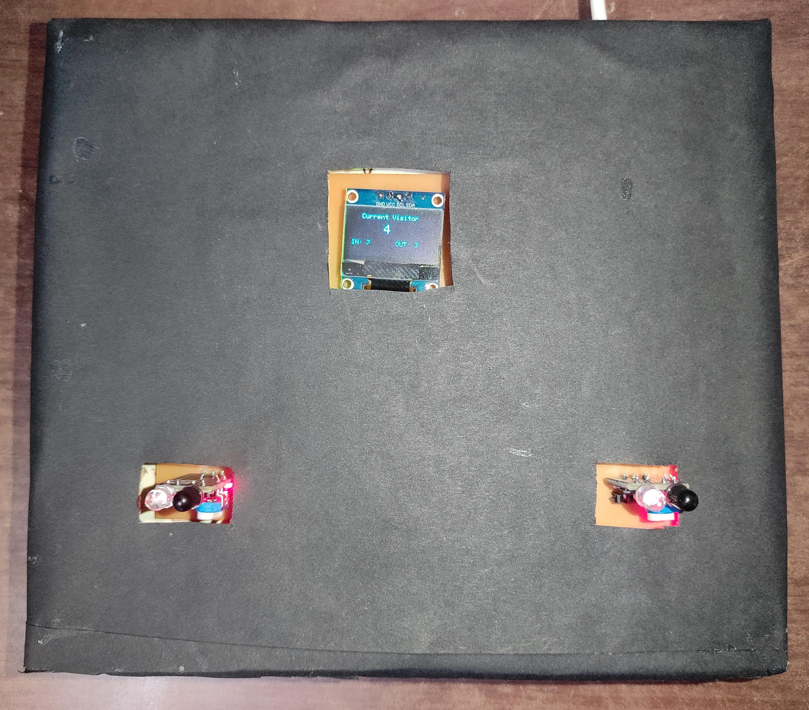
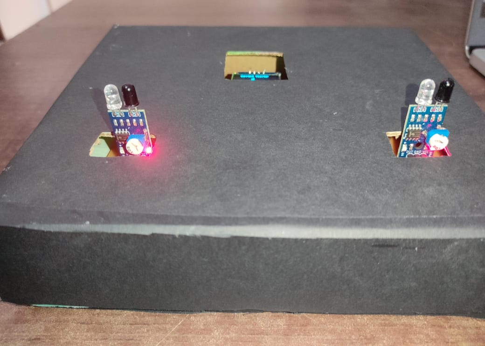

# 📊 Bidirectional Visitor Counting System

A smart IoT-based system to automatically count incoming and outgoing visitors using IR sensors, with real-time monitoring on an OLED display, Blynk mobile app, and ThingSpeak web dashboard.

---

## 🚀 Overview

This system is designed to track the number of people entering and exiting a room. It uses two IR sensors — one at the entrance and one at the exit. The ESP8266 NodeMCU microcontroller processes the sensor data, calculates the current number of visitors present, and displays the data on:

- OLED display (on the device)
- Blynk mobile app (for remote monitoring)
- ThingSpeak (for web-based analytics)

---

## 🔧 Hardware Used

- ESP8266 NodeMCU
- IR Sensors (2 units)
- OLED Display (0.96" I2C)
- Breadboard and Jumper wires
- USB Power Supply

---

## 🌐 IoT Platforms Integrated

### 📱 Blynk App
- Shows total incoming visitors
- Shows total outgoing visitors
- Shows current visitors present

### 🌍 ThingSpeak
- Sends real-time data to the cloud
- Useful for graphing and data logging

---

## ⚙️ Working Logic

- **IR Sensor 1 (Entrance):** Detects and increments the incoming count.
- **IR Sensor 2 (Exit):** Detects and increments the outgoing count.
- **Present Visitors = Incoming - Outgoing**

The system then updates:
- OLED display (for local view)
- Blynk App (for remote access)
- ThingSpeak (for cloud analytics)

---

## 🧠 Features

- Bidirectional people counting using 2 IR sensors
- Live visitor count on OLED
- Real-time updates to Blynk app
- Web analytics via ThingSpeak
- Subtracts outgoing visitors from incoming visitors to calculate present count

---

## 🔮 Future Scope

- Add a buzzer when capacity exceeds limit
- Log data over time and export to CSV
- Use Firebase or MQTT for faster cloud communication
- Add LCD touchscreen for manual control/reset

---
## 📸 Project Prototype

### Prototype Image 1  

### Prototype Image 2  

